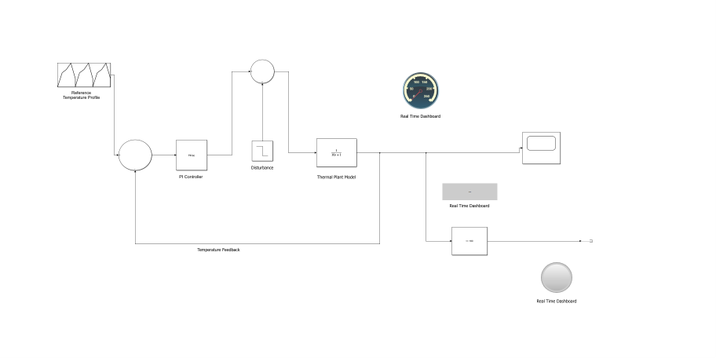
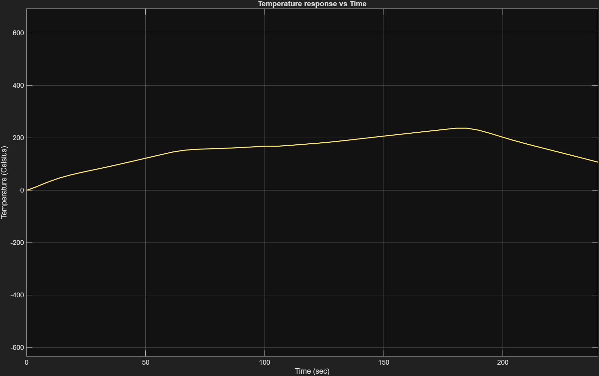
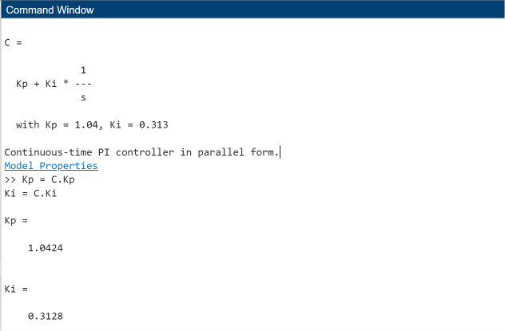
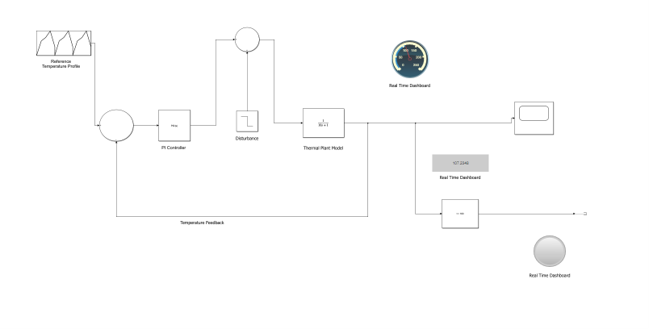
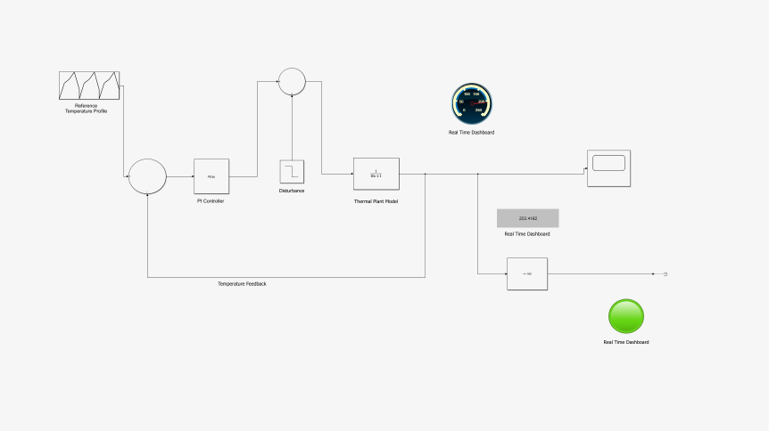

# Multi-Zone-Reflow-Oven-PID-Control
## Project Overview:
This project demonstrates the design and simulation of a closed-loop control system for a multizone reflow oven using MATLAB Simulink. I have implemented a PI Controller to track the desired reflow soldering temperature profile accurately maintaining the sysytem stabality and minimizing temperature error.
Also I have demonstrate both manual PI Tuning and MATLAB automatic tuning using the function 'pidtune()'.

## Project Objectives:
- Designing a closed loop temperature control system.
- Simulating the thermal dynamics of reflow oven.
- Implentation of PI control for temperature regulation.
- Comparison of manual and automatic controller tuning.
- And analysis of system response under different operating conditions.

## Project Features:
- MATLAB Simulink implementation: A MATLAB Simulation is created using the blocks-
 - Repeating sequence: It generates the reflow oven temperature profile i.e. reference input.
 - Sum: It is the reference feedback and calculates the error between desired and actual temperature.
 - PID Controller(Configured as PI): It controls the heater based on the temperature error.
 - Disturbance (sum+step): Adds the disturbance i.e. heat loss to the control output at specific time here at 100th sec.
 - Transfer function: It models the thermal dynamics of the reflow oven.
 - Scope:Displays the behaviour of temperature response vs time. 
- Automatic PI tuning: First the model is analysed using the manual PID tuning and then MATLAB auto tuning is done using 'pidtune()' function. In this   model PID controller is configured to PI with values of P= 1.0424 and I=0.3128.
- Temperature profile tracking:Temperature profile tracking is the process of ensuring that the oven temperature accurately follows the predefined reflow temperature profile using a closed-loop controller.
- Disturbance analysis: To create a real time situation for the reflow oven disturbances are allowed to enter the oven and this is demonstrated by using a step and sum block which results to a heatloss at an instant of time here at 100th sec. 
- Time constant comparison: Time constant comparison is used to study how different time constants affect the speed of the oven's temperature response and overall system dynamics.
- Dashboard: The dashboard provides real-time monitoring of the simulated reflow oven using:

    - Circular Gauge - Displays the current oven temperature.
    - Digital Display - Shows the exact temperature value.
    - Status Lamp - Indicates the heating/reflow status based on the temperature threshold.

## Transfer Function:
The thermal plant is modeled as first order system,
\[
G(s)=\frac{1}{10s+1}
\]

## Controller:
Final PI controller parameters are as follows,
Kp=1.0424
Ki=0.3128
Kd=0

## Software used:
- MATLAB R2025b
- Simulink
- Control System Toolbox
- Git 
- Github

## Simulation Results:
The PI controller successfully tracks the desired reflow temperature profile while maintaining stable closed-loop performance.

The simulation demonstrates:
- Accurate temperature profile tracking
- Stable closed-loop response
- Manual and automatic PI controller tuning
- Disturbance rejection capability
- Time constant comparison
- Real-time monitoring using the dashboard (Gauge, Display, and Status Lamp)

### 1. Simulink Model

The complete closed-loop PI control model of the multi-zone reflow oven.

### 2. Manual PI Tuning Response

Temperature response obtained using manually tuned PI controller parameters.

### 3. Automatic PI Tuning

MATLAB `pidtune()` was used to automatically determine the optimal PI controller gains.

### 4. Dashboard Monitoring

The dashboard provides real-time monitoring of the oven temperature using a Circular Gauge, Digital Display, and Status Lamp.

### 5. Temperature Threshold Indication

The Status Lamp turns ON when the oven temperature exceeds the predefined threshold (180°C), indicating that the reflow temperature has been reached.

## Future Improvements:
- Multi-zone thermal model
- Adaptive PID control
- Model Predictive Control (MPC)
- Hardware implementation using Arduino/STM32
- Real-time temperature sensing

## Author
*Preeti Sharma*
Dr. B.R. Ambedkar National Institute of Technology Jalandhar

## License
This Project is developed for academic and learning purposes.